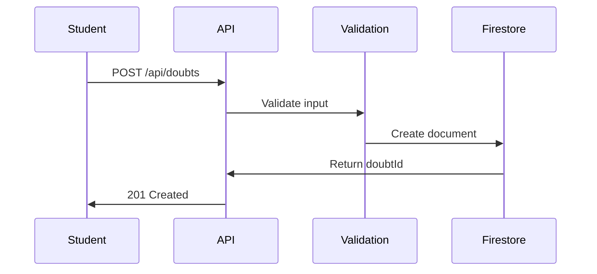
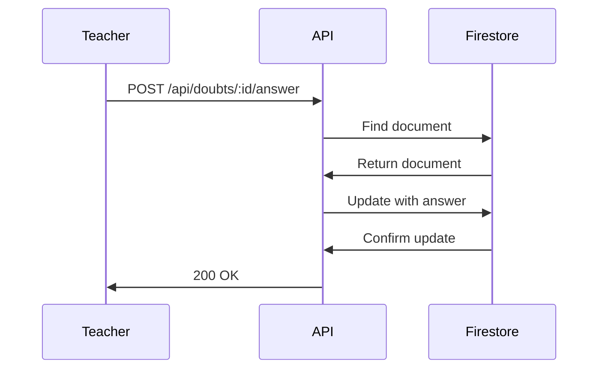

# Firestore Database Schema

Complete database schema documentation for **WhisperBoard** - Anonymous Doubt Submission System.

---

## 📊 Database Overview

**Database Type**: Firebase Firestore (NoSQL Cloud Database)  
**Project**: WhisperBoard  
**Collections**: 1 main collection (`doubts`)

---

## 🗂️ Collection: `doubts`

Stores all anonymous doubt submissions from students and teacher responses.

### Collection Structure

```
doubts/
├── {doubtId1}/
│   ├── id: string
│   ├── subject: string
│   ├── courseCode: string
│   ├── teacher: string
│   ├── question: string
│   ├── answer: string | null
│   ├── status: string
│   ├── createdAt: timestamp
│   └── answeredAt: timestamp | null
├── {doubtId2}/
└── {doubtId3}/
```

---

## 📋 Document Schema

### Document ID
- **Type**: `string`
- **Auto-generated**: Yes (Firestore auto-ID)
- **Format**: Random alphanumeric (e.g., `abc123xyz789`)
- **Unique**: Yes

### Fields

#### 1. `id` (Document ID)
- **Type**: `string`
- **Required**: Auto-generated by Firestore
- **Description**: Unique identifier for each doubt
- **Example**: `"kF7mN2pQrT8vX4wZ"`
- **Indexed**: Yes (primary key)

#### 2. `subject`
- **Type**: `string`
- **Required**: Yes
- **Validation**: Non-empty string
- **Description**: Subject/course name of the doubt
- **Example**: `"Database Systems"`, `"Data Structures"`
- **Min Length**: 1 character
- **Max Length**: 255 characters

#### 3. `courseCode`
- **Type**: `string`
- **Required**: Yes
- **Validation**: Non-empty string
- **Format**: Uppercase (recommended)
- **Description**: Course code identifier
- **Example**: `"CS301"`, `"MATH101"`, `"PHY202"`
- **Min Length**: 1 character
- **Max Length**: 20 characters

#### 4. `teacher`
- **Type**: `string`
- **Required**: Yes
- **Validation**: Non-empty string
- **Description**: Name of the teacher to whom doubt is addressed
- **Example**: `"Dr. Smith"`, `"Prof. Johnson"`
- **Min Length**: 1 character
- **Max Length**: 100 characters

#### 5. `question`
- **Type**: `string`
- **Required**: Yes
- **Validation**: Minimum 10 characters
- **Description**: The doubt/question submitted by student
- **Example**: `"What is the difference between SQL and NoSQL databases? Which one should I use for my project?"`
- **Min Length**: 10 characters
- **Max Length**: 5,000 characters

#### 6. `answer`
- **Type**: `string | null`
- **Required**: No (null until answered)
- **Validation**: Minimum 10 characters when provided
- **Description**: Teacher's response to the doubt
- **Example**: `"SQL databases are relational and use structured schemas..."`
- **Default**: `null`
- **Min Length** (when set): 10 characters
- **Max Length**: 10,000 characters

#### 7. `status`
- **Type**: `string`
- **Required**: Yes
- **Validation**: Enum - `"Pending"` or `"Answered"`
- **Description**: Current status of the doubt
- **Possible Values**:
  - `"Pending"` - Doubt submitted, awaiting teacher response
  - `"Answered"` - Teacher has provided an answer
- **Default**: `"Pending"`

#### 8. `createdAt`
- **Type**: `timestamp`
- **Required**: Yes
- **Auto-generated**: Yes (server timestamp)
- **Description**: Date and time when doubt was submitted
- **Format**: Firestore Timestamp
- **Example**: `2024-01-15T10:30:00.000Z`
- **Indexed**: Yes (for sorting)

#### 9. `answeredAt`
- **Type**: `timestamp | null`
- **Required**: No
- **Auto-generated**: Yes (when answer is submitted)
- **Description**: Date and time when teacher answered the doubt
- **Format**: Firestore Timestamp
- **Example**: `2024-01-15T11:00:00.000Z`
- **Default**: `null`

---

## 📝 Complete Document Example

### Pending Doubt
```json
{
  "id": "kF7mN2pQrT8vX4wZ",
  "subject": "Database Systems",
  "courseCode": "CS301",
  "teacher": "Dr. Smith",
  "question": "What is the difference between SQL and NoSQL databases? Which one should I use for my e-commerce project?",
  "answer": null,
  "status": "Pending",
  "createdAt": "2024-01-15T10:30:00.000Z",
  "answeredAt": null
}
```

### Answered Doubt
```json
{
  "id": "kF7mN2pQrT8vX4wZ",
  "subject": "Database Systems",
  "courseCode": "CS301",
  "teacher": "Dr. Smith",
  "question": "What is the difference between SQL and NoSQL databases? Which one should I use for my e-commerce project?",
  "answer": "SQL databases (like MySQL, PostgreSQL) are relational databases with structured schemas, ACID properties, and strong consistency. They're great for complex relationships and transactions. NoSQL databases (like MongoDB, Firestore) are non-relational, flexible, and horizontally scalable. For your e-commerce project, I recommend SQL (PostgreSQL) if you need complex inventory management and transactions, or MongoDB if you need flexibility with product catalogs and high scalability.",
  "status": "Answered",
  "createdAt": "2024-01-15T10:30:00.000Z",
  "answeredAt": "2024-01-15T11:00:00.000Z"
}
```

---

## 🔍 Indexes

### Composite Indexes

For optimal query performance, create these indexes:

1. **Default Index**
   - Field: `createdAt`
   - Order: Descending
   - Purpose: Sort doubts by creation time (most recent first)

2. **Teacher Filter Index**
   - Fields: `teacher` (Ascending), `createdAt` (Descending)
   - Purpose: Get doubts for specific teacher, sorted by time

3. **Status Index**
   - Fields: `status` (Ascending), `createdAt` (Descending)
   - Purpose: Filter by pending/answered status

### Create Indexes via Firebase Console

1. Go to Firebase Console → Firestore Database
2. Click **Indexes** tab
3. Click **Create Index**
4. Add fields as specified above

### Create Indexes via Firebase CLI

```bash
# firestore.indexes.json
{
  "indexes": [
    {
      "collectionGroup": "doubts",
      "queryScope": "COLLECTION",
      "fields": [
        { "fieldPath": "teacher", "order": "ASCENDING" },
        { "fieldPath": "createdAt", "order": "DESCENDING" }
      ]
    },
    {
      "collectionGroup": "doubts",
      "queryScope": "COLLECTION",
      "fields": [
        { "fieldPath": "status", "order": "ASCENDING" },
        { "fieldPath": "createdAt", "order": "DESCENDING" }
      ]
    }
  ]
}
```

Deploy:
```bash
firebase deploy --only firestore:indexes
```

---

## 🔒 Security Rules

### Current Rules (Development)

Located in `firestore.rules`:

```javascript
rules_version = '2';
service cloud.firestore {
  match /databases/{database}/documents {
    match /doubts/{doubtId} {
      // Allow anyone to read doubts
      allow read: if true;
      
      // Allow anonymous doubt creation
      allow create: if request.resource.data.status == 'Pending'
                    && request.resource.data.answer == null;
      
      // Allow updates for answering
      allow update: if request.resource.data.status == 'Answered'
                    && request.resource.data.answer is string;
      
      // Prevent deletion
      allow delete: if false;
    }
  }
}
```

### Production Rules (Recommended)

```javascript
rules_version = '2';
service cloud.firestore {
  match /databases/{database}/documents {
    
    // Helper: Check if user is authenticated teacher
    function isTeacher() {
      return request.auth != null 
        && request.auth.token.role == 'teacher';
    }
    
    match /doubts/{doubtId} {
      // Students can read their own doubts (if authenticated)
      // Teachers can read all doubts
      allow read: if request.auth != null;
      
      // Allow authenticated users to submit doubts
      allow create: if request.auth != null
                    && request.resource.data.status == 'Pending'
                    && request.resource.data.answer == null;
      
      // Only teachers can answer
      allow update: if isTeacher()
                    && request.resource.data.status == 'Answered';
      
      // Only teachers can delete
      allow delete: if isTeacher();
    }
  }
}
```

---

## 📊 Query Patterns

### 1. Get All Doubts (Recent First)
```javascript
db.collection('doubts')
  .orderBy('createdAt', 'desc')
  .get()
```

### 2. Get Doubts by Teacher
```javascript
db.collection('doubts')
  .where('teacher', '==', 'Dr. Smith')
  .orderBy('createdAt', 'desc')
  .get()
```

### 3. Get Pending Doubts
```javascript
db.collection('doubts')
  .where('status', '==', 'Pending')
  .orderBy('createdAt', 'desc')
  .get()
```

### 4. Get Answered Doubts
```javascript
db.collection('doubts')
  .where('status', '==', 'Answered')
  .orderBy('createdAt', 'desc')
  .get()
```

### 5. Get Specific Doubt by ID
```javascript
db.collection('doubts')
  .doc(doubtId)
  .get()
```

### 6. Get Recent Doubts (Last 10)
```javascript
db.collection('doubts')
  .orderBy('createdAt', 'desc')
  .limit(10)
  .get()
```

### 7. Get Doubts by Course Code
```javascript
db.collection('doubts')
  .where('courseCode', '==', 'CS301')
  .orderBy('createdAt', 'desc')
  .get()
```

---

## 📈 Data Flow

### Student Submits Doubt



**Document Created**:
```javascript
{
  subject: "Database Systems",
  courseCode: "CS301",
  teacher: "Dr. Smith",
  question: "What is normalization?",
  answer: null,
  status: "Pending",
  createdAt: serverTimestamp(),
  answeredAt: null
}
```

### Teacher Answers Doubt



**Document Updated**:
```javascript
{
  // ... existing fields unchanged
  answer: "Normalization is the process...",
  status: "Answered",
  answeredAt: serverTimestamp()
}
```

---

## 🎯 Best Practices

### Data Validation

✅ **Always validate**:
- Subject is not empty
- Course code format
- Question minimum length (10 chars)
- Answer minimum length (10 chars)

### Performance

✅ **Optimize queries**:
- Use indexes for filtered queries
- Limit results with `.limit(n)`
- Use pagination for large datasets
- Cache frequently accessed data

### Security

✅ **Secure your data**:
- Deploy Firestore security rules
- Validate input on server-side
- Sanitize user input
- Use environment variables for secrets

### Scalability

✅ **Design for scale**:
- Use subcollections for related data
- Batch write operations when possible
- Monitor usage and quotas
- Implement caching strategy

---

## 📏 Constraints & Limits

### Firestore Limits

| Resource | Limit |
|----------|-------|
| Document size | 1 MB |
| Field name length | 1,500 bytes |
| String field length | 1 MB |
| Writes per second | 10,000 |
| Collections per document | 100 |

### Application Limits

| Field | Min | Max |
|-------|-----|-----|
| Question | 10 chars | 5,000 chars |
| Answer | 10 chars | 10,000 chars |
| Subject | 1 char | 255 chars |
| Course Code | 1 char | 20 chars |
| Teacher Name | 1 char | 100 chars |

---

## 🔧 Migration & Seeding

### Seed Sample Data

```javascript
// seed-data.js
const admin = require('firebase-admin');
const db = admin.firestore();

const sampleDoubts = [
  {
    subject: "Data Structures",
    courseCode: "CS201",
    teacher: "Dr. Johnson",
    question: "What is the time complexity of binary search?",
    answer: null,
    status: "Pending",
    createdAt: admin.firestore.FieldValue.serverTimestamp(),
    answeredAt: null
  },
  {
    subject: "Database Systems",
    courseCode: "CS301",
    teacher: "Dr. Smith",
    question: "Explain ACID properties in databases.",
    answer: "ACID stands for Atomicity, Consistency, Isolation, Durability...",
    status: "Answered",
    createdAt: admin.firestore.FieldValue.serverTimestamp(),
    answeredAt: admin.firestore.FieldValue.serverTimestamp()
  }
];

// Add to Firestore
sampleDoubts.forEach(async (doubt) => {
  await db.collection('doubts').add(doubt);
});
```

---

## 📚 Related Documentation

- [Firebase Firestore Documentation](https://firebase.google.com/docs/firestore)
- [Backend API Documentation](./README.md)
- [Postman Testing Guide](./POSTMAN_TESTING.md)

---

**Schema Version**: 1.0.0  
**Last Updated**: January 2024
